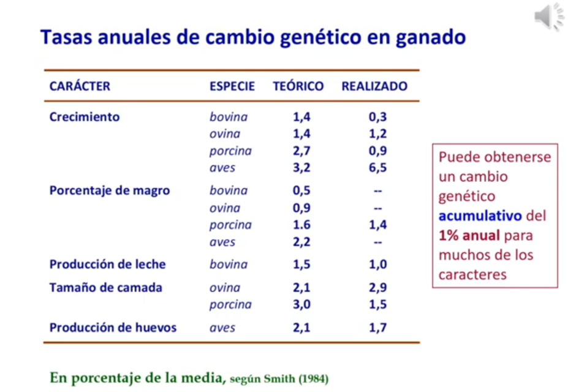
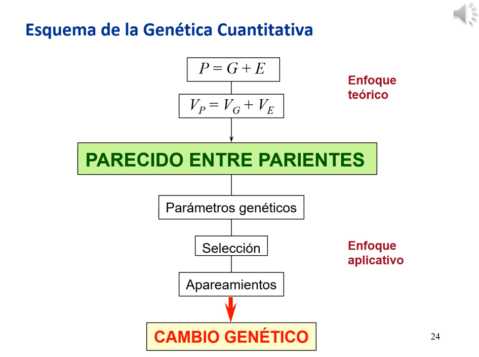
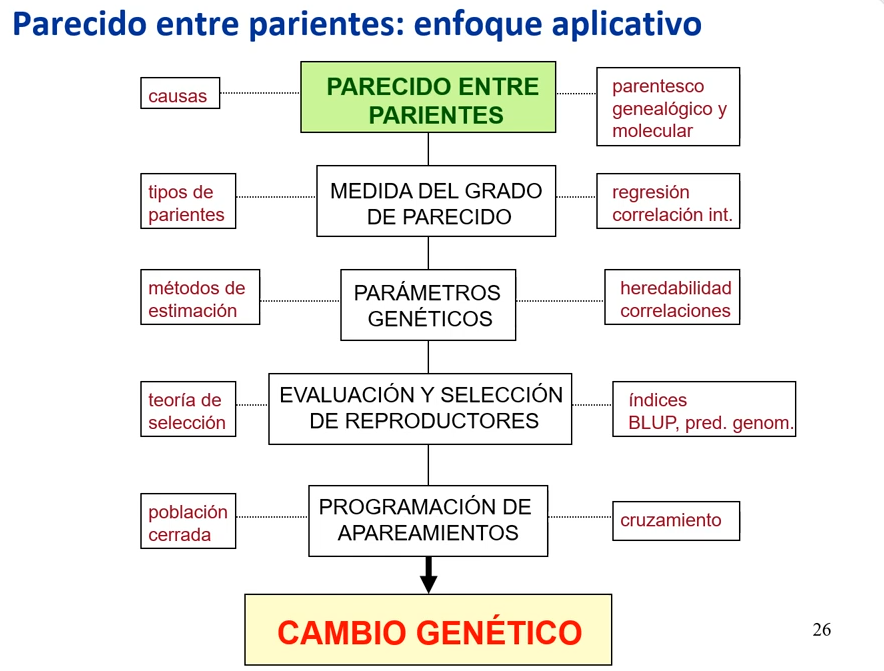

# 1. Introducción 

*Enlace de la clase: [https://youtu.be/2wmx86eTRZE](https://youtu.be/2wmx86eTRZE)*

-----

### 1.1. Introducción a la Genética cuantitativa y sus aplicaciones

El artículo fundacional de la Genética Cuantitativa lo presenta Ronald Fisher en 1918. Sin embargo, el termino se populariza cuando Falconer publica su libro *Introduction to Quantitative Genetics* en 1981. Según esta edición, **"la genética cuantitativa tiene por objeto el estudio de la herencia de las diferencias entre los individuos, diferencias que son más de grado que de clase, es decir, cuantitativas en lugar de cualitativas."**

Los campos de aplicación de la genética cuantitativa son: 

- Evolución de las poblaciones naturales 
> A través de las diferencias del *fitness*.

- Análisis de caracteres complejos en humanos, animales y plantas
> Por ejemplo, se vió que había cardiopatías que se clasificaban en grupos definidos pero se ajustaban a una herencia de caracteres cuantitativos. 

- Mejora genética animal y vegetal

Las dos primeras aplicaciones nos permiten analizar y conocer fenómenos naturales, mientras que la última nos permite modificar la naturaleza en función de nuestros intereses. 

Todas o casi todas las plantas comerciales (alimentos, decoración, etc.) son plantas seleccionadas. En el periodo de 1930-1990, el cultivo de maiz aumentó 7 veces su rendimiento. Se estima que el 40% se debe a mejoras agronómicas y el 60% se debe a mejoras genéticas. En la mejora de plantas, es importante la interacción genotipo - ambiente, lo que se conoce como tolerancia al estrés. Recurriendo de nuevo al maiz, la mejora genética en el periodo 1930-1990 permitió aumentar la producción de maíz cuando hay menos recursos disponibles para cada planta.

En cuanto al ganado, se ha obtenido un importante cambio genético. Depende del carácter y de la especie. El cambio teórico es aquel que depende de la heredabilidad, de la variabilidad y de la intensidad de la selección. Para la mayoría de caracteres, se puede obtener un cambio **acumulativo** del 1% anual. 

|  |
| :-- |
| **Figura 1.** Tasas anuales de cambio genético en ganado |

Los agentes responsables de la mejora son: empresas privadas, asociaciones de ganaderos y programas nacionales. En cuanto a vegetales, grandes empresas como *Monsanto* o empresas locales como *Semillas Fitó*. En vacuno de leche, la selección la hacen empresas de inseminación (y en menor grado cooperativas), pero también hay programas nacionales (en España hay 3 o 4). Este caso requiere colaboración con los ganaderos para el control del parentesco y de las condiciones de cría. En cuanto a los cerdos, actualmente 3 empresas multinacionales dan origen al 60% de los cerdos consumidos a nivel mundial (la más importante, el 25%). Las aves tienen una agrupación similar, con 4 grandes grupos que controlan la producción. 

Ramas de la genética implicadas en la mejora: 

- **Genética de poblaciones:** aporta la base teórica, permite hace un seguimiento de la consanguinidad y establecer relaciones entre poblaciones.   

- **La genética cuantitativa:** tiene por objetivo evaluar las relaciones entre parientes, basadas en las ideas del modelo infinitesimal, del cual deriva el proceso de selección.  

- **Genética molecular:** aporta marcadores para la determinación de QTLs, permiten el diagnóstico de enfermedades, también contribuyen al control de parentesco y de forma limitada, la edición génica (pocos casos por la complicación y por la regulación de la comercialización).   

### 1.2. Esquema de la Genética cuantitativa y resumen del curso
La Genética cuantitativa gira en torno a analizar y describir el parecido entre parientes (un individuo alto, tiende a dar descendientes altos). 

|  |
| :-- |
| **Figura 2.** Esquema de la Genética cuantitativa | 

El curso se dividirá en el estudio tanto de la parte teórica como de la parte práctica. 

#### Enfoque teórico

Partiendo del modelo infinitesimal, por el cual los caracteres cuantitativos son el resultado de la acción de múltiples genes. El fenotipo está determinado por la base genética del individuo, que a su vez tiene un componente aditivo, uno de dominancia y otro de interacción, y por el ambiente, que tiene a su vez un componente general y un componente especial. De igual modo, las varianzas se dividirán en los mismos componentes. En referencia a la varianza aditiva, hablaremos de la **heredabilidad (h²)**, y analizar la varianza ambiental general nos llevará a un parámetro llamado **repetibilidad**

|  |
| :-- |
| **Figura 3.** Enfoque teórico del parecido entre parientes, dentro del marco del modelo infinitesimal | 

Este enfoque se podrá relacionar con la detección de genes de caracteres cuantitativos (QTL) a través del *Genome Wide Association Studies* o GWAS, que es la técnica más empleada para la detección de genes asociados a un QTL.

Todo esto será la base para establecer el parecido entre parientes. **En este curso, veremos los fundamentos genéticos y estadísticos, así como la relación de estas cuestiones con las frecuencias génicas.** 

#### Enfoque práctico

A la hora de aplicarlo, mediremos el grado de parecido entre pariendes a través de parámetros genéticos. Estos determinarán el esquema de selección, que mediante ciertos apareamientos darán lugar a una mejora del carácter a nivel de la población.

|  |
| :-- |
| **Figura 4.** Enfoque práctico del parecido entre parientes | 

- Relacionaremos las causas del parecido entre parientes y con los componentes de las varianzas que hemos visto antes, y las relacionaremos con el parentesco genealógico (pedigree) y molecular. 

- Haremos una medida del grado de parecido mediante regresión y correlación intra-clase (derivada de la estimación de componentes de varianza en diseños ANOVA)

- Estandarizaremos la medida del grado de parecido con los parámetros genéticos y veremos los diferentes métodos de estimación que existen, lo que nos llevará al cálculo de h² y correlaciones entre el componente genético de dos caracteres. 

- Se hará la evaluación y selección de reproductores mediante BLUP y predicción genómica (GBLUP), enlazando esto con la teoría de selección. 

- Una vez seleccionados los individuos, nos plantearemos como aparearlos (población cerrada o cruzamiento). 

Al final, obtendremos un **cambio genético** que se medirá como la diferencia entre la media de la población generada respecto a la media de la población original. 

---

###### 27/05/2022