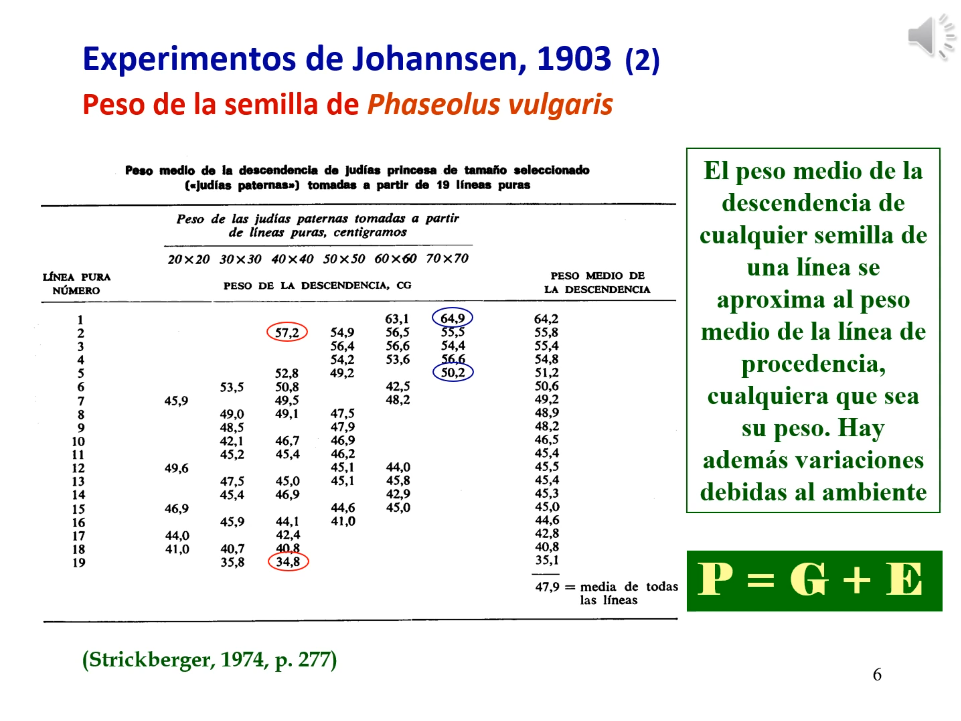

# 2. Caracteres Métricos 

*Enlace de la clase: [https://youtu.be/zPNCYJ9baLc](https://youtu.be/zPNCYJ9baLc)*

---

Los caracteres pueden ser cualitativos (discontinuos) o cuantitativos (continuos, por lo general son complejos). 

Existían dos posturas separadas en cuanto a la herencia genética:

- La **mendeliana** defendía que las diferencias hereditarias evolutivamente importantes son cualitativas y discontinuas y que las pequeñas variaciones se debían al ambiente
- La **biométrica** creía que la variación hereditaria es cuantitativa y continua. 

```{R, collapse=FALSE}
# execute code if the date is later than a specified day
do_it = Sys.Date() > '2018-02-14'
```

Dos experimentos acercan ambas posturas. 

1. El **experimento de Johannsen**, fijó 19 líneeas por autofecundación que tenían un peso medio determinado y cruzó semillas del mismo peso pero de diferentes líneas. 

|  |
| :-- |
| **Figura 1.** Experimento de Johannsen con semillas de guisante | 

2. El **experimento de Nilsson-Ehle**, cruzó dos líneas de trigo con granos blancos y rojos. El cruce dió lineas rosadas. Al cruzar de nuevo esta linea, resultaron semillas blancas, rojas, rosadas, rosadas más intensas... Al observar las frecuencias de los fenotipos, llegó a la conclusión de que este carácter estaba codificado por 3 genes que tenían una acción aditiva. Cada gen presentaba dos alelos: uno añadía pigmento blanco y otro pigmentación roja. La distribución del cruce de la F1 (heterocigota para todos los alelos) se acerca a una distribución normal, que es la esperada para los caracteres métricos. Esto venía a indicar que había un caracter métrico que era poligénico (factor múltiple)

|  |
| :-- |
| **Figura 2.** Experimento de Nilsson-Ehle con semillas de guisante | 


Si en lugar de 3, tuviéramos más genes, el histograma seria aún más próximo a la normal (haya dominancia o aditividad). Esto se ve apoyado por el **teorema central del límite** que postula que *cuando los valores observados de una variable son el resultado de un __conjunto grande__ de causas independientes, siendo el __efecto individual de poca importancia__, es esperable que los valores sigan una distribución normal*. Para los caracteres métricos, esto se cumple ya que estarían determinados por múltiples genes y por múltiples efectos ambientales. 

---

###### 15-06-2022