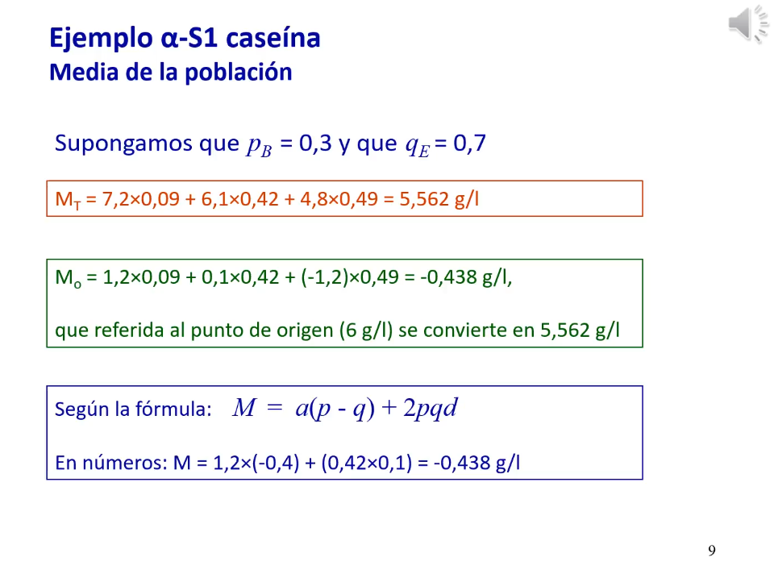

# 3. Valores y medias en el modelo infinitesimal

*Enlace de la clase: [https://youtu.be/roVfh47Q_10](https://youtu.be/roVfh47Q_10)*

---

*En esta lección, se desarrolla la teoría infinitesimal siguiendo el libro de Falconer (concretamente, el capítulo que lleva el mismo título que esta lección).*

## 3.1. Valores

Para un locus bialélico, tenemos una serie de valores numéricos asociados a cada locus para un determinado caracter: **los valores genotípicos**. El *origen* (punto de referencia, punto cero) de este locus sería la media de los valores genotípicos de los dos homocigotos, y los valores de los distintos genotipos se expresan en referencia a este punto cero:

- El homocigoto A2A2 tendría un valor genotípico *-a*. 
- El homocigoto A1A1 tendŕia un valor genotípico *+a*.
- El heterocigoto, A1A2, tendŕia un valor genotípico *d*.

|  |
| :-- |
| **Figura 1.** Ejemplo de los valores genotípicos para el caso del contenido de alpha-S1 caseína en cabra Malagueña. | 

La media de la población se calcula multiplicando cada uno de los valores genotípicos por la frecuencia de estos valores. Esta media es una desviación de la media "bruta" poblacional ya que se calcula a partir de los valores genotípicos, que son desviaciones respecto a la media de la población. 

> El procedimiento empleado para calcular la media de una población es equivalente a la media aritmétrica.

**Como consecuencia de la meiosis, los individuos no transmiten genotipos sino genes.** Cada espermatozoide lleva asociada una cierta cantidad de alelos de un locus. Ambas cantidades se transmiten a la descendencia. Asumiendo equlibrio HW, la probabilidad de que un gameto se encuentre con un gameto portador de uno de ambos locus será la frecuencia de cada locus en la población. Por tanto, para cada gen, podemos calcular el valor medio de los genotipos de la población resultante como la suma de los valores genotípicos de cada genotipo generado por las frecuencias del gen alternativo en la población del otro gameto. Para calcular el **efecto medio del gen**, habría que restarle a este valor medio de los genotipos la media de la población esperada. 

> Al calcular el efecto medio del gen, la media de la población se deduce por conveniencia de fórmulas posteriores.

|  |
| :-- |
| **Figura 2.** Resumen del razonamiento empleado para calcular el efecto medio de un gen. | 

El efecto medio del gen es también el *efecto aditivo* de dicho gen, que se puede entender como "una mochila que se lleva el gen, una aportación cuantitativa a un carácter métrico". El efecto aditivo será una propiedad de la población porque depende de las frecuencias de cada alelo, pero también una propiedad de cada locus, porque depende del valor genético de cada gen. 

El efecto medio de sustitución o $\alpha$ nos informa de como cambiaría la población si fuéramos capaces de sustituir en un locus un alelo por el otro. De nuevo, este efecto es una propiedad de la población y del gen. 

|  |
| :-- |
| **Figura 3.** Ejemplo del cálculo para la media de una población de cabras para la alpha-S1 caseína. | 

Lo que recibe un individuo es un alelo de su padre y uno de su madre, es decir, recibe una cantidad asociada con cada alelo. **Un individuo vale la suma de los dos alelos que ha recibido**, lo que se conoce como **valor mejorante** (también llamado valor aditivo o *breeding value*), es decir, es la suma de los efectos medios de los alelos que ha recibido. 

> De nuevo, estos valores son una propiedad de la población y del gen. También son una propiedad de cada individuo. **El promedio de los valores mejorantes es 0.**

|  |
| :-- |
| **Figura 4.** Ejemplo del cálculo de los valores medios y mejorantes para la alpha-S1 caseina en caprino. *Nota: los efectos medios negativos no supone una disminución de la caseína en el individuo. La interpretación es que este alelo tiene un efecto que está por debajo de la media* | 

En el ejemplo de la *Figura 4*, vemos que al cambiar los alelos A2 por alelos A1, aumentaría la media en 1,24 g/L (efecto medio de sustitución). 

## Desviación dominante

La relación entre el valor mejorante y el valor genotípico es la desviación dominante. Esta se debe a una **interacción intralocus**, es decir, entre los alelos de un mismo locus. Formalmente, la desviación dominante se calcula como la deducción de la media al valor genotípico. Después, expresado en términos de $\alpha$ (el efecto medio de sustitución alélica), le sustraemos el valor mejorante para este genotipo. 

> La desviación dominante depende de la frecuencia alélica (es decir, es también una propiedad de la población) y del grado de aditividad (el valor *d*). Para que exista desviación dominante, d != 0. **El promedio de las desviaciones dominantes es 0.**

## Desviación de interacción o epistática

De momento hemos tenido en cuenta solo la interacción entre los alelos de un mismo locus. Sin embargo, normalmente son muchos los genes que determiann un carácter cuantitativo y se dan también interacciones entre los distintos loci causativos. Esto da lugar a **desviaciones de interacción**, también llamadas desviaciones epistáticas. Esta interacción se puede dar entre dos o más loci. 

> La desviación de la interacción media en una población es 0 cuando se expresa como desviación a la media de la población. 

## Valores a partir de la regresión del valor genotípico

Otra forma de entender todos estos conceptos es a través de una regresión del valor genotípico sobre la dosis génica (*Figure 5*)

|  |
| :-- |
| **Figura 5.** Regresión del valor genotípico sobre la dosis génica para obtener los valores mejorantes, el efecto de sustitución alélica y la desviación dominante. | 

Los puntos negros en la *Figura 5* serían los valores genotípicos (-a, d, a) para cada uno de los genotipos en función de sus genotipos (asumiendo equilibrio HW). Sobre estos puntos, ajustamos una recta de regresión y de ella, podemos calcular:

- Los valores predichos para cada frecuencia por la regresión ajustada serían los **valores mejorantes o _breeding values_**
- La **desviación dominante** sería la distancia entre el valor genotípico y el *breeding value*.
- El coeficiente de la regresión (la pendiente de la recta) sería el **efecto medio de sustitución alélica ($\alpha$)**. *Por tanto, lo que indica es el aumento de la variable dependiente (breeding value) en función del aumento de la variable dependiente (número de alelos).*

Esta regresión es el fundamento genético de técnicas modernas como el GWAS. 

---

###### 21-07-2022