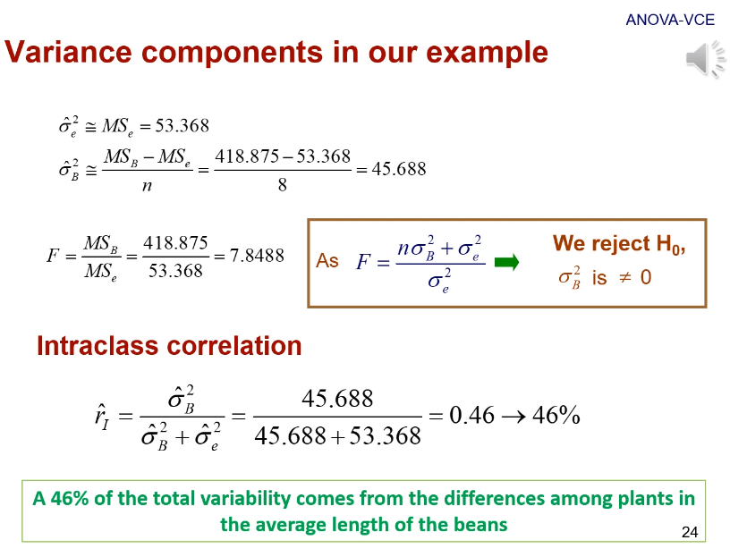

# 4. Componentes de varianza y correlación intra-clase

*Enlace de la clase: [https://youtu.be/ibgna6SOZ1A](https://youtu.be/ibgna6SOZ1A)*

---

Para esta lección, vamos a emplear los datos de un pequeño experimento para asentar mejor los conceptos. El experimento consiste en comparar la longitud de la vaina en diferentes plantas (**s=5**). Para ello, se miden **n=8** muestras de cada planta. 

|  |
| :-- |
| **Figura 1.** Datos del experimento que usaremos durante esta lección. | 

Hay que tener en cuenta de que este diseño es **equilibrado**, es decir, tiene el mismo número de observaciones para cada grupo.

Adicionalmente, dejo aquí una figura adicional que resume las propiedades de los sumatorios (*Figura adicional 1a*) y las propiedades de las expectaciones y las varianzas (*Figura adicional 1b*)

|  |  |
| :--: | :--: |
| **Figura adicional 1a.** Propiedades de los sumatorios. | **Figura adicional 1b.** Propiedades de las expectaciones y las varianzas. | 

## 4.1. ANOVA

Para hacer un ANOVA, tenemos que en primer lugar descomponer la varianza en dos componentes: la varianza dentro de cada grupo y la varianza entre grupos. Para hacer este análisis, asumimos un modelo lineal aditivo en el que cada valor depende de una media general ($\mu$), el efecto de cada planta ($g$) y el error ($e$).

> El error ($e$) recoge el resto de efectos que no se incluyen en el modelo. Por ejemplo, para este modelo el error recogería el efecto de la temperatura, la humedad, la presión, etc.

|  |
| :-- |
| **Figura 2.** Descomposición de la varianza asumiendo un modelo lineal aditivo. *$y_{ij}$ es el valor de cada muestra $j$ en cada planta $i$; $\overline{y}_{..}$ es la media general; $\overline(y)_{i.}$ es la media de cada grupo.* | 

La variación se mide como la suma de cuadrados (el desarrollo para llegar a las equivalencias aparece en el video):

- La suma de cuadrados total es la desviación de cada muestra respecto a la media general. Su equivalente sería $\sum_{ij}y^2_{ij} - \frac{y^2_{..}}{sn}$
- La suma de cuadrados "intra-grupo" es la desviación de cada observación a la media de su grupo. Su equivalente sería $\sum_{ij}y^2_{ij} - \frac{1}{n} \sum_{i}y^2_i$
- La suma de cuadrados "inter-grupo" es la desviación de cada media grupal a la media general. Su equivalente sería $\frac{1}{n} \sum_{i}y^2_i - \frac{y^2_{..}}{sn}$

    > Para la suma de cuadrados "inter-grupo", la *n* está multiplicando la suma de cuadrados porque estaríamos sumando para $j$ algo que no tiene $j$. Esto, según las propiedades de los sumatorios (*Figura adicional 1a*), equivale a multiplicar por el número de $j$ que tenemos. 

Si nos fijamos en las equivalencias de cada suma de cuadrados, podemos observar que las tres se pueden definir a partir de tres cantidades básicas:  
- $\sum_{ij}y^2_{ij}$  
- $\frac{1}{n} \sum_{i}y^2_i$  
- $\frac{y^2_{..}}{sn}$

Con estas equivalencias, podemos construir la clásica tabla de ANOVA (*Figura 3*). Al resolverla, obtendríamos el estadístico F y a partir de él podríamos determinar la probabilidad de que nuestras conclusiones se deban al azar (p-value).

|  |  |
| :--: | :--: |
| **Figura 3a.** Tabla ANOVA empleando las cantidades básicas equivalentes. | **Figura 3b.** Resolución de la tabla ANOVA empleando los datos de nuestro experimento de ejemplo. | 

Para nuestro ejemplo, la resolución de la tabla ANOVA (*Figura 3b*) daría lugar al rechazo de la hipótesis nula, concluyendo que las medias de las vainas de las diferentes plantas difieren. 

## 4.2. Modelos (de efectos) aleatorios

Los modelos aleatorios, al igual que los fijos, tienen una serie de supuestos (*Figura 5*). En cuanto a los efectos aleatorios:

- La esperanza de la variable aleatoria (en este caso, la planta) es $E(g_i) = 0$

- La esperanza del efecto de grupo elevado al cuadrado es igual a la varianza entre grupos $E(g^2_i) = \sigma^2_B$. Esto viene del desarrollo de la primera propiedad de la varianza (*Figura adicional 1b*):  
    - $\sigma^2_B = E(g^2_i) - E(g_i)$
    - como $E(g_i) = 0$, nos queda $\sigma^2_B = E(g^2_i)$
> La varianza también se podría anotar como $\sigma^2_{g_i}$. Al ser la varianza de los efectos de cada planta, también se puede anotar como la varianza **entre** los grupos de plantas. 

- Se asume independencia de las plantas, ya que $E(g_i g_{i'}) = 0$

En cuanto a los errores:

- La esperanza del error es $E(e_{ij}) = 0$
- La esperanza de los errores al cuadrado, aplicando un razonamiento similar que en el caso de los efectos, es igual a la varianza de los errores $E(e^2_{ij}) = \sigma^2_e$
- Los errores de un mismo grupo y los errores de diferentes grupos son independientes $E(e_{j(i)} e_{j'(i)}) = E(e_{j(i)} e_{j'(i')}) = 0$

Para calcular los componentes de varianza, necesitaremos calcular las **esperanzas de los cuadrados medios**, que eran el cociente de la suma de cuadrados partidos por los grados de libertad. La suma de cuadrados se podía obtener a partir de las tres cantidades básicas: $\sum_{ij}y^2_{ij}$, $\frac{1}{n} \sum_{i}y^2_i$ y $\frac{y^2_{..}}{sn}$. 

El cálculo de las esperanzas de estas tres cantidades básicas lo podemos encontrar en la *Figura 6*.

|  |  |  |
| :--: | :--: | :--: |
| **Figura 6a.** Suma de cuadrados (muestra) | **Figura 6c.** Suma de cuadrados (grupo) | **Figura 6c.** Suma de cuadrados (general) | 

Ahora calcularemos las esperanzas de las sumas de cuadrados:

- La **esperanza del cuadrado medio del error** (o la varianza dentro de los grupos) (*Figura 7a*) es $\sigma^2_e$. Esto implica que **la esperanza del cuadrado medio del error es un estimador insesgado de la varianza del error.**
> *Un estimador de un parámetro se dice que es **insesgado** si su valor esperazo es igual al valor verdadero*, [fuente](https://www.statlect.com/glossary/unbiased-estimator)

- La **esperanza del cuadrado medio entre grupos** (*Figura 7b*) es $n\sigma^2_B + \sigma^2_e$. En este caso, obtenemos un **estimador sesgado**. 

|  |  |
| :--: | :--: |
| **Figura 7a.** Esperanza del cuadrado medio del error | **Figura 7b.** Esperanza del cuadrado medio del efecto |

Para estimar los componentes de varianza, podemos emplear ambas ecuaciones para tener un sistema de dos ecuaciones con dos incógnitas ($\hat{\sigma}^2_B$ y $\hat{\sigma}^2_e$), ya que tanto $n$ como $MS_e$ y $MS_B$ son cantidades conocidas. De este modo, resolviendo este sistema de ecuaciones, podemos obtener las estimaciones para ambos componentes de varianza. El estadístico $F > 1$ solo se dará cuando $\sigma^2_B > 0$, por lo que podremos rechazar la hipótesis nula $\sigma^2_B = 0$.

## 4.3. Correlación intraclase

La **correlación intraclase es la proporción de la variación total atribuida al componente aleatorio estudiado** (en este caso, las diferentes plantas). Esta correlación se deriva de la correlación de Pearson. Podemos encontrar su desarrollo en la *Figura 8*, que concluye que $r = \frac{\sigma^2_B}{\sigma^2_B\sigma^2_e}$. 

|  |  |  |
| :--: | :--: | :--: |
| **Figura 8a.** Correlación de Pearson ($r$) y covarianza | **Figura 8c.** Correlación de Pearson ($r$) y la raíz cuadrada del producto de las varianzas | **Figura 8c.** Correlación intraclase de nuestro ejemplo | 

Para diseños equilibrados como el que hemos usado de ejemplo, los componentes de varianza estimado obtenidos con un modelo de la partición de la varianza y un modelo REML son idénticas. 

---

###### 02-08-2022