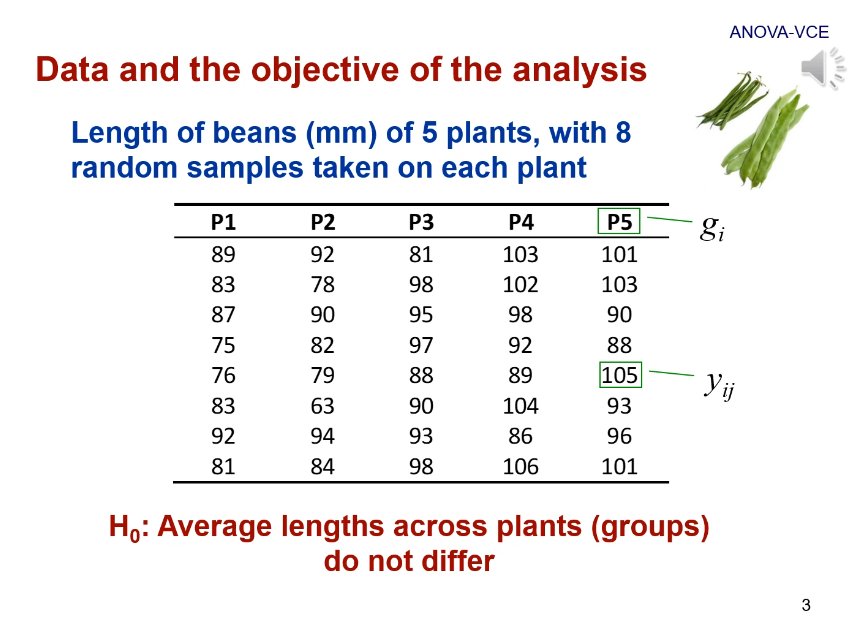

# 5. Varianzas genéticas

*Enlace de la clase: [https://youtu.be/GOnXPxKfLJ0](https://youtu.be/GOnXPxKfLJ0)*

---

En esta lección, continuamos empleando los datos del ejemplo de la lección anterior:

|  |
| :-- |
| **Figura 1.** Datos del experimento que usaremos durante esta lección. | 

En esta lección, analizaremos cómo son las varianzas. En primer lugar, debemos recordar que la varianza muestras es un estimador de la varianza poblacional, y es el sumatorio de las desviaciones de cada observación a la media general, todo elevado al cuadrado (Suma de Cuadrados), dividido por los grados de libertad, en este caso $n-1$. 

|  |
| :-- |
| **Figura 2.** La varianza muestral como estimador de la varianza poblacional. | 

Ya vimos en la **Lección 3** la descomposición de los componentes de la varianza fenotípica. El conocimiento de estos componentes de varianza nos va a permitir conocer la relevancia de cada uno de ellos relativa a la varianza fenotípica total. Es de especial relevancia la varianza aditiva, por ejemplo, que es la principal responsable del parecido entre parientes. 

|  |
| :-- |
| **Figura 3.** Descomposición de la varianza fenotípica. | 

## Varianza aditiva

La varianza aditiva es la varianza de los valores mejorantes. Si nos centramos en la varianza aportada por un único locus, partiendo que la media de los valores mejorantes es 0 ($E(x)=0$), obtenemos que la fórmula de la varianza (originalmente, $V_x = E(x²) + E(x)²$) se ve reducida a $E(x²)$; en este caso, la esperanza de los valores mejorantes al cuadrado. La media de los valores mejorantes se calcula como el valor mejorante de cada genotipo por su frecuencia. 

|  |
| :-- |
| **Figura 4.** Varianza aditiva. | 

Como vemos en la *Figura 3*, la varianza aditiva depende en última instancia de las frecuencias del genotipo y del efecto medio de susticución alélica ($\alpha$). Por este motivo, decimos que la varianza aditiva es una propiedad de la población (frecuencias alélicas que dependen de la población) y del carácter (efecto medio de sustitución).

## Varianza de dominancia

De nuevo, tenemos que la media de la dominancia es igual a 0, por lo que la varianza de la desviación de dominancia es la media de las desviaciones de dominancia al cuadrado. Al igual que la anterior, la varianza dominante es una propiedad de la población y el carácter. 

|  |
| :-- |
| **Figura 5.** Varianza de dominancia. |

## Varianza total de un locus

Se puede demostrar, como vemos en la *Figura 6*, que estas son independientes. Por lo tanto, la varianza total de un locus sería la suma de la varianza aditiva y la varianza dominante. 

|  |
| :-- |
| **Figura 6.** Varianza total de un locus como suma de $V_A + V_D$. |

Si nos fijamos en el gráfico de la izquierda de la *Figura 6*, extraído de *Falconer (1970)*, podemos ver:

- a) si no existe varianza dominante, el máximo valor se alcanza cuando $p=q=0.5$. 
- b) con dominancia completa, $d=a$ y la varianza genética total del locus sigue dependiendo de las frecuencias génicas. En este caso, el máximo se alcanza en valores ligeramente superiores, pero la varianza es aún así baja cuando la frecuencia alélica es baja. 
- c) con sobredominancia (los heterocigotos presentan mayor valor genético que los homocigotos), $d>a$, el maáximo se alcanza de nuevo en frecuencias génicas intermedias, aunque la curva no es tan pronucniada como en a). 

De este gráfico podemos concluir que los **loci con frecuencias génicas intermedias aportan más a la varianza**.

|  |
| :-- |
| **Figura 7.** Ejemplo para la $a$-S1 caseina de la varianza total de un locus. |

## Varianza de interacción (o epistática)

Si nos circunscribimos a la interacción entre dos factores, puede haber interacción de dos factores: entre dos valores mejorantes ($V_AA$), entre el valor mejorante de un locus y la desviación dominante del otro ($V_AD$) y entre dos desviaciones dominantes ($V_DD$). **La varianza de interacción es la suma de todos estos componentes**.

La varianza genotípica global sería la suma de las varianzas aditivas y dominantes que aportasen todos los loci más la varianza de interacción entre todos ellos. 

## Correlación genotipo-ambiente

A veces, nos encontramos que el componente genético y el componente ambiental no son independientes. Por ejemplo, en la producción lechera es común alimentar a las vacas según su nivel de producción (que es un valor condicionado de forma importante por el genotipo). Esto provoca que los valores genotípicos no sean independientes entre sí. 
En este caso, se genera un coeficiente de covarianza entre ambos componentes, que normalmente se desconoce con exactitud. 

Otra perturbación a la fórmula $V_P = V_G + V_E$ se da cuando se produce una interacción entre el genotipo y el ambiente. La idea es que una misma variación ambiental no tendrá el mismo efecto en todos los genotipos. Un ejemplo puede ser que el aumento de la cantidad de alimento en diferentes razas de producción lechera. Para algunas razas, el aumento de alimento comporta un aumento de producción, mientras que en otras no tiene efecto o incluso tiene un efecto negativo. Este efecto es definido como la "norma de reacción" o la "sensibilidad ambiental" (acuñado por Falconer). 

---

###### 29-08-2022