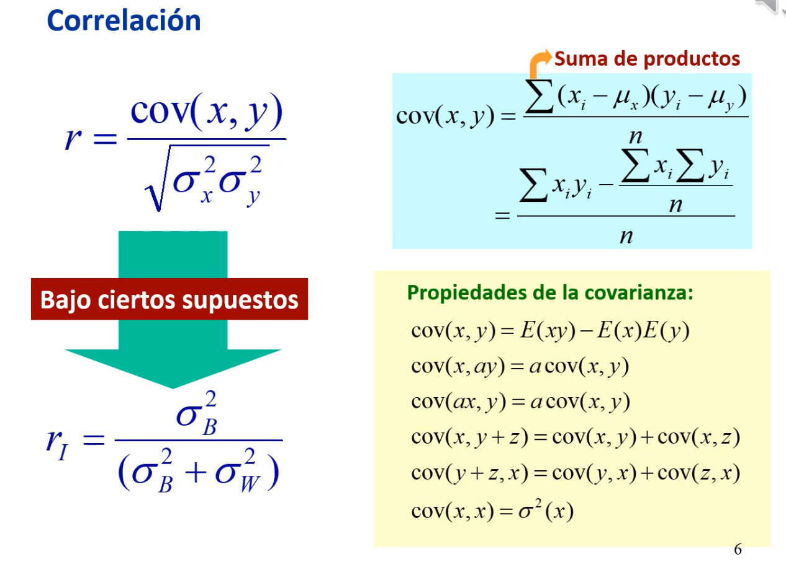
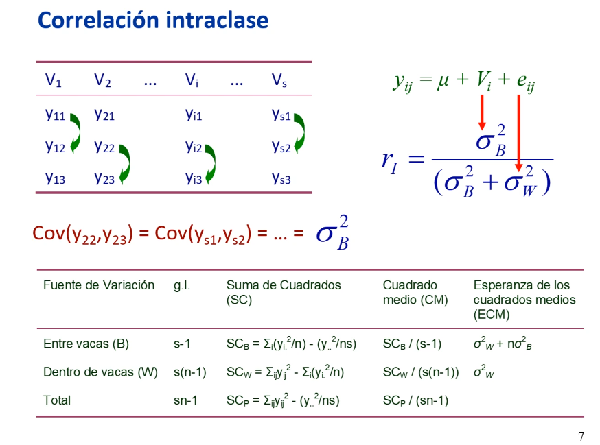
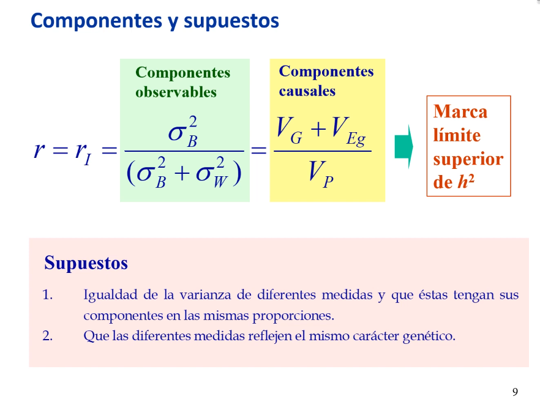

# 6. Varianza ambiental (repetibilidad)

*Enlace de la clase: [https://youtu.be/hPk58gclNxs](https://youtu.be/hPk58gclNxs)*

---

La varianza ambiental es una fuente de error que reduce la precisión de los estudios genéticos. Entre otras, las causas de la varianza ambiental son: 

- Factores nutritivos, climáticos y de manejo, 
- Efectos maternos (por ejemplo, el crecimiento del ternero, que se ve afectada por la capacidad de lactancia de la madre). 
- Errores de medida. 
- Escalas subjetivas (por ejemplo, al valorar los aspectos físicos de un caballo).
- Efectos del medio interno. 

Hay carecteres que se pueden medir de forma repetida, tanto en el tiempo (ej., producción lechera) como en el espacio (ej., peso de frutos de la misma planta). En cualquier caso, la varianza ambiental puede descomponerse en:

- Varianza ambiental **general o permanente**, que se debe a circunstancias permanentes y no localizadas y sería el componente entre individuos. 
- Varianza ambiental **especial**, que se debe a circunstancias localizadas y temporales y que sería el componente intra-individuos. 

Al medir de forma repetida un mismo individuo, la variación entre lasc diferentes medidas se denomina **repetibilidad**. La repetibilidad se puede estimar como la "correlación entreclases" (correlación de Pearson) cuando tenemos 2 medidas por individuo, lo cual no es usual. Lo más normal es tener varias medidas por individuo (el peso de varios frutos para una misma planta), y en este caso tendremos que usar la "correlación intraclase". La medida de la repetibilidad será relevante a la hora de determinar el grado de parecido entre parientes. 

Partiendo de la correlación de Pearson, que es el cociente de la covarianza entre dos variables y la raíz del producto de las varianzas de ambas variables, podemos llegar a la corrlación intraclase siempre que se cumplan *ciertos supuestos* (supuestos en *Figura 8b* de [*lección 4: Componentes de Varianza*](https://joancg.github.io/curso_GCM/leccion_4/)). 

> Se asume un modelo lineal aditivo en el que cada valor ($y$) depende de una media general ($\mu$), el efecto de grupo ($V_i$) y el error ($e_{ij}$). Adicionalmente:   
>   - $cov(\mu,\mu)$=0;  
>   - $cov(\mu,V_i)$=0;  
>   - $cov(V_i,V_i)$=$\sigma^2_{g_i}$;  
>   - $cov(V_i,e_{ij})$=$cov(e_{ij},V_i)$=0;  
>   - $cov(e_{ij},e_{ij})$=0;  

La correlación intraclase se calcularía como el cociente de la varianza entre individous y la suma de la varianza entre y dentro de individuos (*Figura 1*). 

|  |
| :-- |
| **Figura 1.** Correlación intraclase ($r_I$) a partir de la correlación de Pearson ($r$). | 

Para obtener la correlación intraclase, necesitamos tener los datos según individuos en un diseño one-way ANOVA. En la Figura 2 (diapo 7, min 10:50), tenemos la medición de la lactación en 3 vacas en s lactaciones. El desarrollo lo tenemos en la *Figura 8* de la [*lección 4: Componentes de Varianza*](https://joancg.github.io/curso_GCM/leccion_4/))

|  |
| :-- |
| **Figura 2.** Diseño one-way ANOVA para la estimación de la correlación intraclase ($r_I$). | 

La repetibilidad, al ser un cociente de una parte de la varianza total, puede tomar valores entre 0 (la media de cada individuo es idéntica y las observaciones son diferentes, la varianza "entre idividuos" es 0) y 1 (variabilidad dentro de un mismo individuo es 0). 

La repetibilidad puede estimarse a través de una correlación intraclase cuando tenemos unos componentes observables (varianza entre y dentro de), obtenidos a partir de los datos. Si nos planteamos el origen de la varianza "entre", podemos recurrir a los componentes causales mediante razonamiento. **¿Por qué se diferencia la producción en las distintas lactaciones de dos vacas?** Porque evidentemente tienen diferentes genotipos. Adicionalmente, también estará condicionada por efectos ambientales "generales", que eran circunstancias permanentes y no localizadas (*Figura 3*). 

|  |
| :-- |
| **Figura 3.** Componentes causales y observables de la correlación intraclase ($r_I$). | 

Notablemente, **la repetibilidad marca el límite superior de la h²**, ya que la varianza genotípica incluye la varianza aditiva, cuyo cociente con la varianza fenotipica es la h², además de otras varianzas genéticas (dominancia e interacción). También tenemos en el numerador el efecto ambiental general. En un caso ideal, todas las varianzas salvo la aditiva serían iguales a 0, y de este modo repetibilidad = h². En relación con los componentes observables se han tenido que asumir (i) que las varianzas de diferentes medidas sean iguales y (ii) que los componentes estén en las mismas proporciones, y que las medidas reflejen el mismo caracter genético, es decir, los mismos genes estén implicados en las medidas (esta asunción se ha mostrado incierta en muchos casos. Por ejemplo, para la lactación, en la primera la vaca es joven y hay genes diferentes implicados que cuando es mayor). 

Las **aplicaciones de la repetibilidad** son:   
- Nos **orienta sobre la h²** (es su límite superior).  
- **Aumenta la precisión de la predicción de los valores genéticos** o mejorantes (GEBV). 

> *NOTA: la varianza fenotípica disminuye a medida que medimos más veces al individuo, aunque no de forma lineal.*

---

###### 09-09-2022