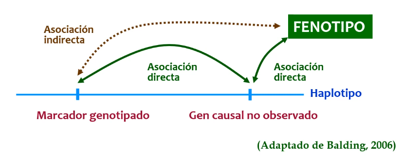
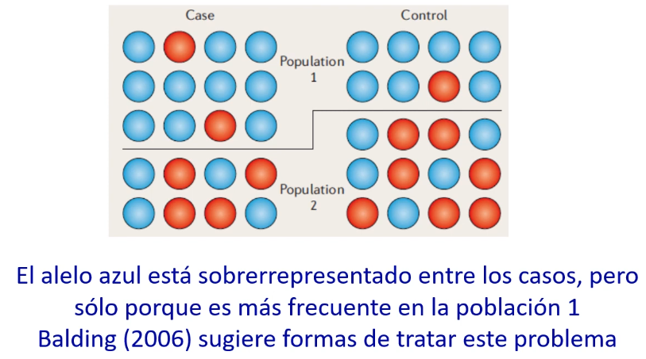
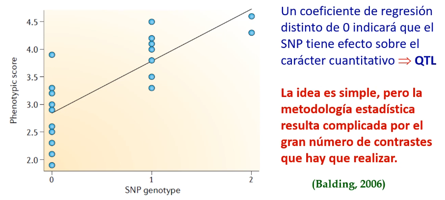
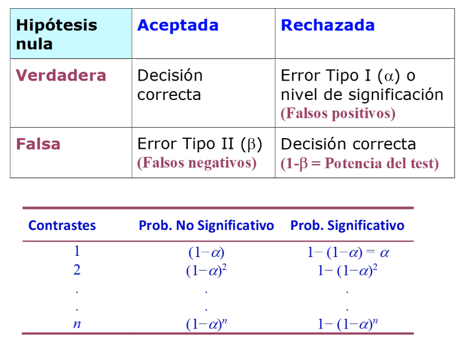
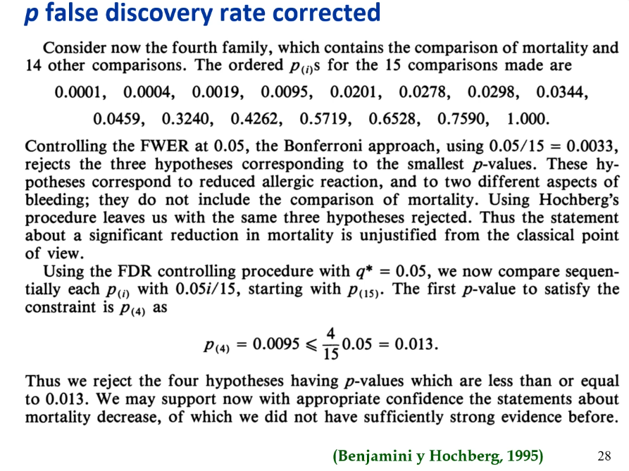
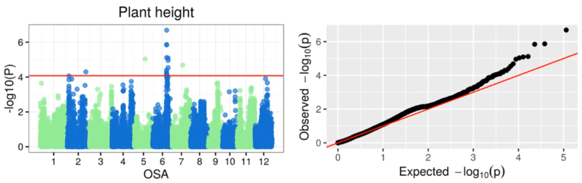
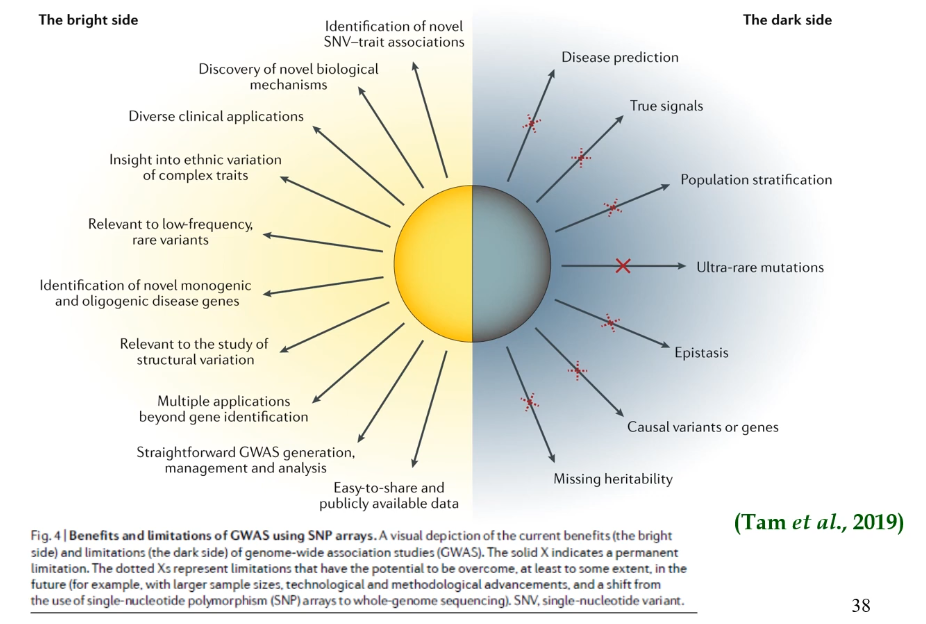

# 7. GWAS

*Enlace de la clase: [https://youtu.be/VSFJwFcB1Kk](https://youtu.be/VSFJwFcB1Kk)*

---

Los caracteres cuantitativos están determinados por un gran número de loci. Teóricamente, un número infinito de loci. A estos loci los conocemos con el nombre de QTLs (*Quantitative Trait Loci*).

Por tanto, un QTL es un gen o segmento de ADN que afecta a un carácter cuantitativo. Este se detecta mediante marcadores, que son puntos de referencia en el genoma. Estos marcadores deben tener una asociación directa con el gen causal que pretende detectarse, que a su vez tendría una asociación directa con el fenotipo de interés. Por tanto, la asociación del marcador con el carácter cuantitativo analizado sería indirecta. Esto se puede apreciar en el esquema de la Figura 1. 

|  |
| :-- |
| **Figura 1.** Representación esquemática de las asociaciones entre marcadores y genes causales para la detección de QTLs. | 

Los marcadores genéticos deben tener las siguientes características: 

- Presentar elevada variabilidad
- Especificidad para una sola zona del genoma
- Repartidos uniformemente por todo el genoma
- Neutros
- Codominantes
- Abundantes
- Asociados con los QTLs

Los **marcadores directos**, que codifican la mutación funcional, es difícil de detectarlos y demostrar su funcionalidad. 

Por otra parte, los **marcadores en equilibro de ligamiento** con la mutación funcional (por ejemplo, poblaciones F2 que son cruce entre poblaciones genéticamente divergentes y en las que se generan asociaciones entre marcadores y mutaciones funcionales), solo son útiles dentro de algunas familias o generaciones concretas, y fueron populares en la segunda mitad del siglo XX con el uso de microsatélites. 

Finalmente, los **marcadores en desequilibrio de ligamiento (LD) poblaciones** con la mutación funcional (SNPs) son consistentes en toda la población. El problema es que se necesita una gran densidad de marcadores, aunque en la actualidad esto se ha superado con los chips de SNPs. Hoy en día, los SNPs son los marcadores genéticos por excelencia. Se derivaron de la secuenciación del genoma humano, y actualmente los métodos de secuenciación permiten detectar un enorme número de variates dialélicas (SNPs). 

## GWAS (*Genome Wide Association Study*)

El GWAS se basa en la idea de que un alelo causal pasará a la descendencia junto a alelos de loci estrechamente ligados. Además, es esperable que los descendientes del individuo con la mutación ancestral presenten el fenotipo analizado en una proporción mayor que la que se encuentra en el resto de la población. 

### Análisis preliminar

Antes de realizar un análisis GWAS, se suele realizar un análisis preliminar que tiene como objetivo determinar la calidad de los datos. Los apartados de este análisis son los siguientes:  

- **MAF (*minor allele frequency*)**: suele situarse en > 0.05 para eliminar SNPs raros, ya que los estudios de asociación solo presentan potencia estadística para variantes causales comunes.  
- **Equilibrio Hardy-Weinberg**: de no se así, indicaría desviaciones que sesgarían los resultados (consanguinidad, estratificación de la población, errores de genotipado, selección, etc.). Se determina mediante una $\chi^2$ de Pearson o un Test exacto de Fisher.  
- **Datos genotípicos faltantes**: se puede eliminar el SNP si faltan muchos datos. Se faltan pocos genotipos, se pueden imputar (sustituir los genotipos faltantes por fenotipos predichos).  
- **Desequilibrio de ligamiento**: se puede medir mediante la $r^2$ o $D'$ o la estimación de las tasas de recombinación. Sin embargo, diferentes estudios han observado que el desequilibrio de ligamiento es fuerte cuando los SNPs son cercanos (de media, no siempre) y disminuye conforme la distancia entre SNPs aumenta, por lo que se asume que existe este desequilibrio de ligamiento.   

Concretamente, la estratificación de la población puede generar falsas asociaciones genotipo-fenotipo. Por ejemplo, en un estudio de caso-control, podemos tener muestras procedentes de dos poblaciones, pero que no aporten las mismas muestras a los casos que a los controles. Las diferencias en el número de alelos en cada grupo puede deberse por tanto a diferencias poblacionales y no a diferencias entre casos y controles (*Figura 2*)

|  |
| :-- |
| **Figura 2.** Representación esquemática del efecto que puede suponer la estratificación de la población. | 

### Metodología 

La metodología del GWAS se basa en la **regresión** del **valor fenototípico** sobre la **dosis génica** (expresados como 0-1-2) del alelo de referencia (alelo de menor frecuencia) de un SNP. En esta regresión, el **coeficiente** obtenido sería el **efecto medio asociado con el alelo de referencia**.  

> En otras palabras, se hace la regresión sobre cada SNP sobre el alelo más raro (de referencia): siendo el domocigoto del alelo más raro (2) y el homocigoto del alelo más frecuente (0). Por lo tanto, en la regresión se mediría el incremento asociado al aumentar el alelo raro -> semejante a un **efecto medio de sustitución**.

|  |
| :-- |
| **Figura 3.** Regresión de un SNP para un análisis GWAS. | 

Esta aproximación la definió Fisher para calcular el efecto medio de sustitución, y en principio es bastante simple. Sin embargo, la metodología estadística es complicada principalmente porque tenemos muchos SNPs, aunque también porque la varianza de los diferentes genotipos de un mismo SNP suele variar.  

En el caso de caracteres tipo caso-control (por ejemplo, enfermedad), si conocemos el riesgo para los diferentes genoptipos, podemos hacer un **test de Cochran-Armitage**, que es una regresión del riesgo sobre la dosis génica. El problema de este test es que no tiene potencia en caso de sobredominancia. Como alternativa, se puede realizar una regresión logística regresando el riesgo trasnformado con la transformación logit sobre la dosis génica. También podemos recurrir al test exacto de Fisher para comprobar si un genotipo concreto tiene mayor riesgo de padecer la enfermedad. Además, tenemos toda una familia de test estadísticos distintos (TDT), cuya idea básica es que los alelos asociados con la enfermedad tendrán una probabilidad elevada de ser transmitidos a la descendencia afectada. 

> Esto no me resulta tan interesante y no profundizo, pero lo resumo para saber que en este punto hay más material en caso de ser interesante. 

### Problemas y correcciones 

En cuanto al elevado número de SNPs, y al aumentar el número de contrastes aumenta la probabilidad de reportar falsos positivos (ver *Figura 4*).

|  |
| :-- |
| **Figura 4.** Aumento de la probabilidad de encontrar efectos significativos (falsos positivos) con el número de contrastes. | 

- Una forma de lidiar con este problema es asumir una proporción de falsos positivos global ($\alpha$ para todos los SNPs) de 0.05. En este caso, el error tipo I del contraste en cada SNP ($\alpha'$) debería ser $\alpha=1-(1-\alpha')^n$.  
- Otra alternativa sería utilizar la **corrección de Bonferroni**, que asume $\alpha'=\alpha/n$. En este caso, el $\alpha'$ es muy pequeño cuando hay muchos contraste y se ha visto que es muy conservadora para SNPs estrechamente ligados (muy próximos).  

La estrategia más común es la **corrección de Benjamini-Hochberg** (*false discovery rate or FDR*), que hace fija un límite a la proporción de falsos positivos que encontramos entre todos los positivos. Esta estrategia ordena los p-valor de menor a mayor y compara el p-valor obtenido con la proporción fijada (por ejemplo, 0.05) multiplicada por la posición que ocupa el p-valor en la ordenación que hemos hecho entre el número total de contrastes. 

*__EJEMPLO:__ Pongamos que tenemos 15 contrastes, obtenemos un p-valor para cada uno de ellos y los ordenamos. Tras ordenarlos, comparamos los p-valores obtenidos con los p-valores controlados hasta que se cumple la condición de que el p-valor obtenido inicialmente es menor o igual al p-valor controlado. En la Figura 5, sería el cuarto p-valor, que es 0.0095. Cuadno se cumpla esta condición, el p-valor original sería el umbral para considerar significativos los p-valores anteriores a este. En el caso de ejemplo, solo los 4 primeros p-valores serían considerados significativos.* 

|  |
| :-- |
| **Figura 5.** Ejemplo de corrección Benjamini-Hochberg. | 

### Resultados

La presentación de los resultados de GWAS es a través de **Manhattan plots** como el de la *Figura 6*. Estos plots contienen la información de todos los p-valores en cada uno de los cromosomas. Como los p-valores son muy pequeños, para su presentación se transforman con el logaritmo decimal negativo del p-valor. También se suele marcar un nivel de significación. 

Otra posibilidad es la representación en Q-Q plots, que es una técnica derivada del contraste de la normalidad en la que se contrastan los valores observados frente a los esperados, ya que se observa que los p-valores obtenidos se aproximan a una distribución normal (también sus transformaciones con logaritmos decimales negativos). Las observaciones que se desvían de la diagonal coinciden con los que se desvían de la distribución normal y que tienen una significación mayor. 

|  |
| :--: |
| **Figura 6.** Ejemplo de un Manhattan plot a la izquierda, y de un Q-Q plot a la derecha. En el eje X tenemos los SNPs, divididos según el cromosoma (OSA -> *Oryza Sativa Autosome*) en el que están localizados, en el eje Y tenemos el p-valor transformado con el logaritmo decimal negativo y el límite de significación está indicado con una línea roja. | 

### Aportaciones y limitaciones

A pesar de la popularidad de GWAS desde la secuenciación del genoma humano y de los grandes avances que ha permitido desarrollar, esta técnica cuenta también con una serie de carencias o inconvenientes que limitan su capacidad de análisis (*Figura 7*). 

|  |
| :--: |
| **Figura 7.** Aportaciones y limitaciones de GWAS. | 

---

###### 10-11-2022